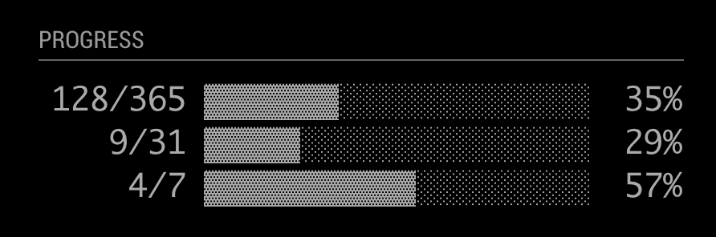

# MMM-Year-Progress

This a module for the [MagicMirror](https://github.com/MichMich/MagicMirror).

This module tracks the progress of the year / month.

## Inspiration

[@year_progress](https://twitter.com/year_progress?lang=en)
[year_progress](http://progressbarserver.appspot.com/)
[Progress Bar](https://itunes.apple.com/us/app/progress-bar/id1441939775)

## Screenshot



## Installation
```bash
git clone https://github.com/ryck/MMM-Year-Progress.git && cd MMM-Year-Progress && npm install && cd ..
```
## Config
The entry in `config.js` can include the following options:

|Option|Description|
|---|---|
|`updateInterval `|How often the arrival information is updated.<br><br>**Type:** `integer`<br>**Default:** `1 min`|
| `debug`             | Show debug information. <br><br>  **Possible values:** `true` or `false`  <br> **Default:** `false`|


Here is an example of an entry in `config.js`

```
{
	module: 'MMM-Year-Progress',
	position: 'bottom_left',
	header: 'Progress',
	config: {
		updateInterval: 60 * 60 * 1000,
		debug: false
	}
},
```

## Dependencies
- None


## Thanks To...
- [Michael Teeuw](https://github.com/MichMich) for the [MagicMirror2](https://github.com/MichMich/MagicMirror/) framework that made this module possible.
